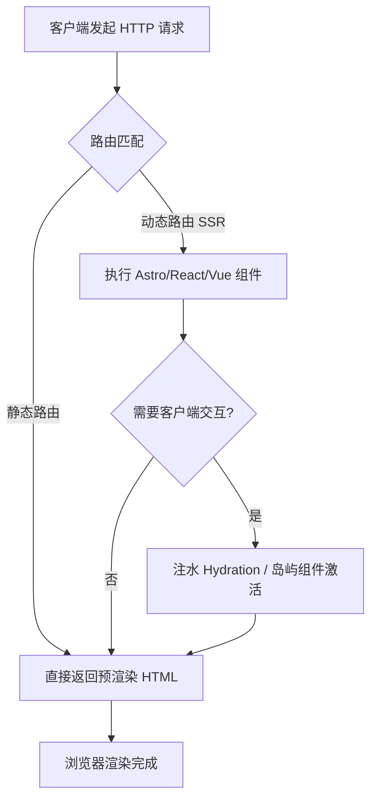
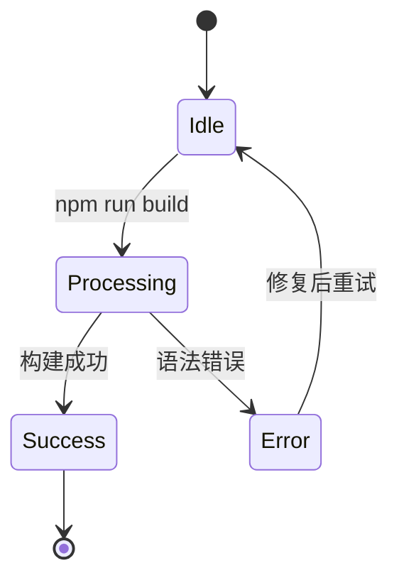

欢迎查阅本篇《Astro 渲染引擎全要素压力测试指南》。本文档旨在全面测试 Astro 框架中基于 Markdown / MDX 的渲染能力，涵盖了从基础文本修饰到复杂代码高亮、科学公式以及数据可视化的**全部核心特性**。

*注：部分高级渲染（如 Mermaid、KaTeX 数学公式）可能需要在 Astro 项目中配置特定的 `remark` 或 `rehype` 插件（如 `remark-math`, `rehype-katex`）才能完美呈现。*

---

## 1. 基础排版与文本修饰

在构建内容驱动型网站时，基础文本的语义化表达至关重要。

### 1.1 文本样式与内联元素
Astro 支持标准的 GitHub Flavored Markdown (GFM) 语法。
- **粗体文本**用于强调核心概念。
- *斜体文本*用于专业术语或书名。
- ~~删除线文本~~用于标记已废弃或过时的 API。
- `行内代码`（Inline Code）用于标记变量名或简短命令，例如 `npm run dev`。
- 键盘快捷键可以使用 HTML 标签渲染：按下 <kbd>Ctrl</kbd> + <kbd>C</kbd> 即可复制。
- 这是一个[指向 Astro 官网的外部链接](https://astro.build)，用于测试锚点标签。

### 1.2 列表系统
#### 无序列表（嵌套测试）
- 核心渲染组件
  - Remark 插件生态
  - Rehype 处理器
- 框架集成
  - React / Vue / Svelte 岛屿架构 (Astro Islands)

#### 有序列表
1. 初始化 Astro 项目
2. 编写 Markdown 内容
3. 启动本地开发服务器
4. 验证页面渲染结果

#### 任务列表 (GFM Checkbox)
- [x] 基础文本排版
- [x] 列表与嵌套结构
- [x] 代码块语法高亮
- [ ] 验证第三方插件 (Mermaid / KaTeX)
- [ ] 移动端响应式测试

---

## 2. 高级数据结构展示

### 2.1 数据表格
表格是展示结构化数据的最佳方式。以下为 Astro 与其他主流 Web 框架的特性对比：

| 框架名称 | 默认渲染策略 | 核心架构 | 零 JS 默认输出 |
| :--- | :---: | :--- | :---: |
| **Astro** | 静态生成 (SSG) / SSR | 岛屿架构 (Islands) | ✅ 支持 |
| **Next.js** | SSR / SSG / ISR | React Server Components | ❌ 依赖水合 |
| **Nuxt** | SSR / SSG | Vue 服务端渲染 | ❌ 依赖水合 |
| **Hugo** | 静态生成 (SSG) | Go 模板引擎 | ✅ 支持 |

### 2.2 引用与注释
> "Astro is the web framework for building content-driven websites."
> 
> — *Astro Official Documentation*
> 
> 包含复杂嵌套的引用：
> > "Content is king, but performance is the kingdom."

**脚注测试**：Astro 的构建速度极快，这得益于其特有的零客户端 JavaScript 策略[^1]。

---

## 3. 开发者核心工具链：代码块高亮

代码块渲染是技术博客的核心诉求。Astro 默认使用 Shiki 进行语法高亮，支持数百种编程语言。

### 3.1 Python (数据科学)
展示 `pandas` 和 `numpy` 的常规操作：

```python
import pandas as pd
import numpy as np

def calculate_astro_metrics(data: list) -> dict:
    """
    计算 Astro 站点性能指标的核心算法
    """
    arr = np.array(data)
    metrics = {
        "mean_load_time": np.mean(arr),
        "p95_latency": np.percentile(arr, 95),
        "is_optimized": all(x < 1.5 for x in arr)
    }
    return metrics

# 模拟数据
load_times = [0.8, 1.2, 0.9, 1.1, 2.4]
print(calculate_astro_metrics(load_times))
```

### 3.2 JavaScript (异步与 ES6+)
展示 Astro 前端岛屿组件（Island）中常见的异步数据获取：

```javascript
// components/FetchAstroData.astro
const fetchGalaxyData = async (endpoint) => {
  try {
    const response = await fetch(`https://api.astro.build/${endpoint}`);
    if (!response.ok) throw new Error(`HTTP error! status: ${response.status}`);
    
    const { data } = await response.json();
    return data.filter(item => item.status === 'active');
  } catch (error) {
    console.error(`[Astro Fetch Error]: ${error.message}`);
    return [];
  }
};

const activeStars = await fetchGalaxyData('stars');
```

### 3.3 Java (面向对象与 Spring Boot)
展示企业级后端的 Controller 示例：

```java
package com.astro.cms.controller;

import org.springframework.web.bind.annotation.*;
import java.util.List;
import java.util.Arrays;

@RestController
@RequestMapping("/api/v1/posts")
public class BlogPostController {

    @GetMapping("/featured")
    public List<String> getFeaturedPosts() {
        // 模拟从数据库获取 Astro 渲染所需的 Markdown 元数据
        return Arrays.asList(
            "Why Astro is the future of SSG",
            "Mastering MDX components",
            "Islands Architecture Explained"
        );
    }
}
```

---

## 4. 科学计算与复杂可视化

对于学术型或技术深度较高的文档，Astro 同样可以通过插件生态完美支持科学排版。

### 4.1 数学公式 (KaTeX / MathJax)
行内公式测试：著名的质能方程 $E = mc^2$ 改变了物理学，而欧拉公式 $e^{i\pi} + 1 = 0$ 则是数学中最美的等式。

块级公式测试（高斯积分）：

$$
\int_{-\infty}^{\infty} e^{-x^2} dx = \sqrt{\pi}
$$

麦克斯韦方程组微分形式：

$$
\begin{aligned}
\nabla \cdot \mathbf{E} &= \frac{\rho}{\varepsilon_0} \\
\nabla \cdot \mathbf{B} &= 0 \\
\nabla \times \mathbf{E} &= -\frac{\partial \mathbf{B}}{\partial t} \\
\nabla \times \mathbf{B} &= \mu_0 \mathbf{J} + \mu_0 \varepsilon_0 \frac{\partial \mathbf{E}}{\partial t}
\end{aligned}
$$

### 4.2 Mermaid 流程图
用于可视化 Astro 的请求处理生命周期：



### 4.3 状态图 (State Diagram)


---

## 5. 多媒体与扩展元素

### 5.1 图片与占位符
图片渲染测试（带替代文本）：


### 5.2 HTML 嵌入与分割线
在 Astro 的 `.md` 文件中，原生 HTML 的支持程度取决于配置，但基础标签通常可用。
<details>
<summary>点击展开隐藏的测试信息 (HTML Details 标签)</summary>
Astro 允许你在 Markdown 中混用 HTML，这为创建可折叠的 FAQ 或复杂的自定义 UI 提供了极大的便利。
</details>

<br />

*(全文测试完毕，感谢您的阅读。)*

---

[^1]: **零 JS 默认输出 (Zero JS by default)**：Astro 默认将所有的 UI 组件（如 React, Vue）在服务端渲染为纯 HTML，并剥离掉所有的 JavaScript 代码。只有当用户显式声明 `client:load` 或 `client:visible` 时，对应的 JS 才会发送到浏览器。这被称为“岛屿架构”。